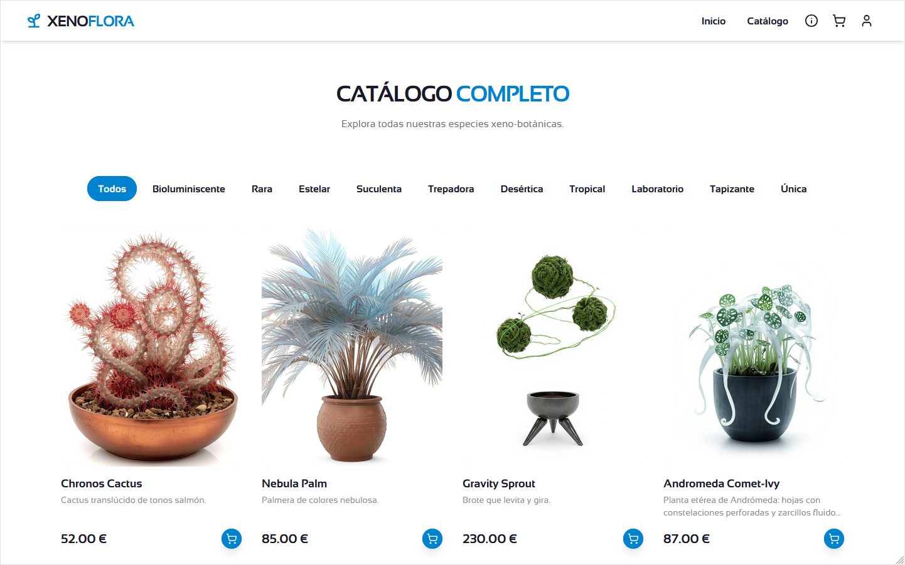
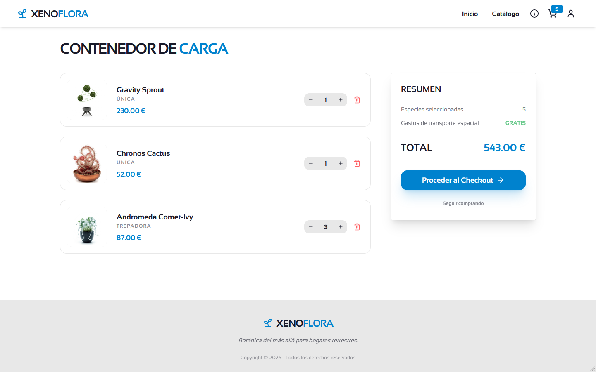
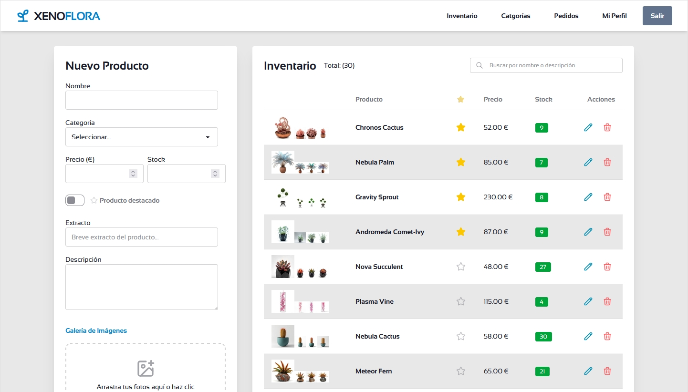

# 🌱 XENOFLORA — Tienda Online Minimalista

Este es el proyecto **"Tienda Online Minimalista"** desarrollado para la formación en **ConquerBlocks**. Es una aplicación Full Stack que utiliza **Django** (backend) y **React** (frontend), simulando una tienda online de plantas alienígenas con catálogo, carrito, checkout y panel de administración.

## 🔗 Demo En Vivo

Puedes probar la aplicación aquí: [https://tienda.grancanash.es](https://tienda.grancanash.es)  
*Los datos se resetean automáticamente cada día a las 00:00 AM. ¡Haz todas las pruebas que quieras!*

### 🔑 Credenciales para la Demo:

| Rol | Usuario | Contraseña | Acceso |
|---|---|---|---|
| Administrador tienda | `demo` | `123456` | Panel React (`/admin`) |
| Cliente | — | — | Compra como invitado o regístrate |

> ⚠️ El usuario `demo` **no** puede acceder al admin de Django (`/admin/`). Solo al panel de gestión de la tienda.

---

## 🛠️ Tecnologías Utilizadas

### Backend
- **Python / Django 6.0**: Framework principal.
- **Django REST Framework**: API RESTful para productos, pedidos y usuarios.
- **PostgreSQL**: Base de datos relacional.
- **JWT (SimpleJWT)**: Autenticación mediante tokens con payload personalizado.
- **Docker**: Containerización del backend, frontend y base de datos.

### Frontend
- **React / TypeScript**: Interfaz de usuario dinámica y tipada.
- **Tailwind CSS v4**: Estilos utilitarios de última generación.
- **daisyUI**: Componentes de interfaz profesionales (botones, cards, modales).
- **Lucide React**: Iconografía minimalista y consistente.
- **Axios**: Cliente HTTP con interceptores para JWT.

---

## ✨ Funcionalidades Clave

- 🛍️ **Catálogo de Productos**: 30 especies xeno-botánicas con imágenes, descripciones, precios y stock.
- 🛒 **Carrito de Compra**: Añadir, quitar y modificar cantidades con persistencia en React Context.
- 📦 **Checkout**: Flujo de compra como invitado o usuario registrado con formulario de envío.
- 📧 **Confirmación por Email**: Envío automático de resumen del pedido (IONOS SMTP en producción, consola en desarrollo).
- 🔐 **Autenticación**: Login tradicional + Google OAuth. Registro post-compra desde la página de agradecimiento.
- 🛡️ **Panel de Administración**: Gestión de productos, categorías y pedidos desde un panel React personalizado.
- 🔄 **Reset Diario Automático**: Cada noche a las 00:00 la tienda vuelve a su estado original (30 productos, sin pedidos).
- 📱 **Responsive Design**: Interfaz adaptada a móvil con menú hamburguesa lateral.
- ℹ️ **Modal de Bienvenida**: Explica el funcionamiento de la tienda en la primera visita, con botón de reapertura en la navbar.

---

## 📸 Capturas de Pantalla

| Catálogo | Carrito | Admin |
|---|---|---|
|  |  |  |

---

## 📁 Estructura del Proyecto

```
tienda-minimalista/
├── backend/                  # Django REST API
│   ├── core/                 # Configuración de Django
│   ├── store/                # App principal
│   │   ├── models.py         # Product, Category, Order, UserProfile...
│   │   ├── views.py          # ViewSets + APIViews + Guest Checkout
│   │   ├── serializers.py    # DRF Serializers + JWT personalizado
│   │   ├── signals.py        # Señales (limpieza de imágenes, auto-perfil)
│   │   └── management/       # Comandos: reset_store, setup_demo_admin
│   ├── fixture.json          # Datos iniciales (30 productos, 10 categorías)
│   └── Dockerfile
├── frontend/                 # React + TypeScript + Tailwind
│   ├── src/
│   │   ├── components/       # WelcomeModal, ProtectedRoute, etc.
│   │   ├── pages/            # HomePage, CatalogPage, CheckoutPage...
│   │   ├── context/          # CartContext (estado global del carrito)
│   │   └── api/              # Axios con interceptores JWT
│   ├── nginx.conf            # Servicio de archivos estáticos y media
│   └── Dockerfile
├── docker-compose.yml        # Orquestación (db + backend + frontend)
├── fixture.json              # Copia raíz del fixture
└── .env.example              # Plantilla de variables de entorno
```

---

## 🔄 Reset Diario Automático

El proyecto incluye un mecanismo de **reset diario** para que la demo siempre esté en condiciones óptimas:

1. **Cron** en la VPS ejecuta `docker compose exec backend python manage.py reset_store` a las 00:00
2. El comando elimina pedidos, productos y categorías, y los recrea desde `fixture.json`
3. Las imágenes de los productos **no se borran** (señal `post_delete` desconectada durante el reset)
4. El usuario `demo` se reconfigura con `setup_demo_admin` (contraseña `123456`, `is_store_admin=True`)

---

## 📄 Licencia

Este proyecto es parte de la formación de **ConquerBlocks** y se utiliza con fines educativos.
